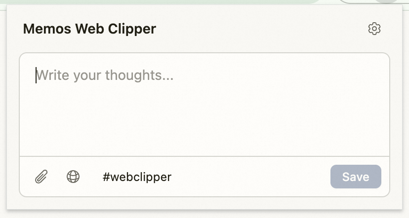

# Memos Web Clipper

A Chrome extension for [Memos](https://github.com/usememos/memos) — clip web pages, capture thoughts, and save everything to your self-hosted Memos instance.



## Features

- **Quick Thought Capture** — Open the popup, type your idea, save. No friction.
- **Web Page Clipping** — Extract full article content as Markdown using Readability + Turndown, with one toggle.
- **Selected Text Clipping** — Right-click any selected text on a page and send it to Memos with source URL.
- **File Upload** — Attach files directly to your memos via the built-in upload button.
- **Memo List** — Browse recent memos directly in the popup with Markdown rendering. Pinned memos appear first. Hover to copy, pin/unpin, delete, or open in Memos web UI. Scroll down to load more.
- **Configurable Tags** — Auto-tag clipped content (default: `#webclipper`) for easy filtering in Memos.
- **Memos-native UI** — Matches the Memos design language (OKLch color tokens, card-based editor layout).

## Install

### From source (development)

```bash
git clone https://github.com/tjkkking/memos-chrome-extension.git
cd memos-chrome-extension
pnpm install
pnpm build
```

Then load in Chrome:

1. Open `chrome://extensions/`
2. Enable **Developer mode**
3. Click **Load unpacked** → select the `dist` directory

### First-time setup

On first install, the Options page opens automatically. Configure:

- **Memos URL** — Your instance address (e.g. `https://memos.example.com`)
- **Access Token** — Create a Personal Access Token in Memos: Settings → Access Tokens

## Usage

### Capture a thought

Click the extension icon → type in the editor → click **Save**.

### Clip a web page

Click the extension icon → toggle the **globe icon** (🌐) in the toolbar → the page content is extracted as Markdown → add your notes → **Save**.

### Clip selected text

Select text on any web page → right-click → **Send selected text to Memos** → add your thoughts in the popup → **Save**.

### Upload a file

Click the **paperclip icon** (📎) in the toolbar → select files → they upload immediately and attach to your memo on save.

## Saved Memo Format

Memos are saved as Markdown. The format depends on what you capture:

**Thought only:**

```markdown
#webclipper

Your thought here
```

**Thought + selected text:**

```markdown
#webclipper

Your comment about the quote

> The selected text from the page

[Page Title](https://example.com/article)
```

**Thought + full page clip:**

```markdown
#webclipper

Your notes about this article

[Article Title](https://example.com/article)

---

Extracted article content in Markdown...
```

## Development

```bash
pnpm install        # Install dependencies
pnpm dev            # Build with watch mode
pnpm build          # Production build
pnpm lint           # TypeScript type check
```

### Tech Stack

| Layer | Technology |
|-------|-----------|
| UI | React 18 + Tailwind CSS v4 |
| Build | Vite |
| Content extraction | [@mozilla/readability](https://github.com/mozilla/readability) + [Turndown](https://github.com/mixmark-io/turndown) |
| API | Memos REST API (`/api/v1/memos`, `/api/v1/attachments`) |
| Auth | Personal Access Token (PAT) via `Authorization: Bearer` header |
| Storage | `chrome.storage.sync` (config), `chrome.storage.session` (pending clips) |

### Project Structure

```
memos-chrome-extension/
├── popup.html / options.html      # Vite HTML entry points
├── vite.config.ts                 # Vite build config
├── public/
│   ├── manifest.json              # Chrome MV3 manifest
│   └── background/service-worker.js
├── src/
│   ├── styles.css                 # Tailwind + Memos theme tokens
│   ├── lib/
│   │   ├── types.ts               # Shared type definitions
│   │   ├── storage.ts             # chrome.storage wrapper
│   │   ├── api.ts                 # Memos API client
│   │   └── formatter.ts           # Memo content formatter
│   ├── popup/
│   │   ├── main.tsx               # Popup entry
│   │   ├── Popup.tsx              # Main popup component
│   │   └── MemoList.tsx           # Memo list with Markdown rendering
│   └── options/
│       ├── main.tsx               # Options entry
│       └── Options.tsx            # Settings page component
└── dist/                          # Build output (load this in Chrome)
```

## Requirements

- Chrome 102+ (Manifest V3)
- A running [Memos](https://github.com/usememos/memos) instance (v0.24+)
- Node.js 18+ and pnpm for building

## License

[MIT](LICENSE)
